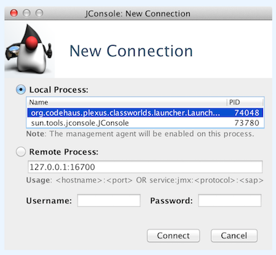
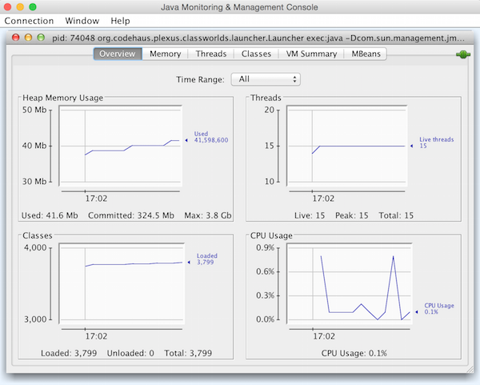
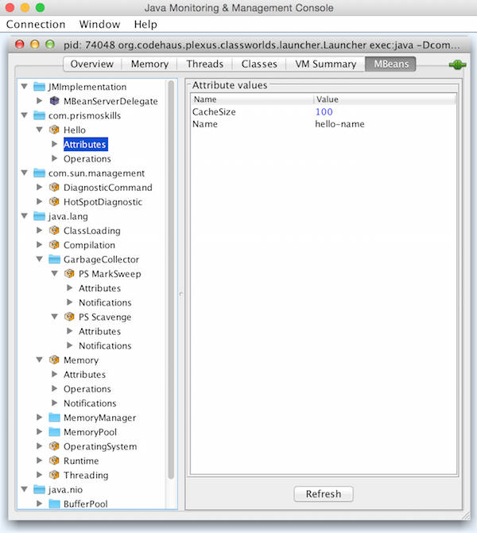

# jmx-tutorial

Reference: [https://docs.oracle.com/javase/tutorial/jmx/mbeans/standard.html](https://docs.oracle.com/javase/tutorial/jmx/mbeans/standard.html)

1. Run as:
    ```bash
        mvn exec:java \
        -Dcom.sun.management.jmxremote \
        -Dcom.sun.management.jmxremote.authenticate=false \
        -Dcom.sun.management.jmxremote.ssl=false \
        -Dexec.mainClass="com.prismoskills.tutorials.jmx.Main"  \
        -Dcom.sun.management.jmxremote.port=16700
    ```

2. Run `jconsole` in another terminal.

3. Select the process corresponding to `org.codehaus.plexus.classworlds...` (Make sure not connected to VPN)
   
4. If there is a warning, choose `Insecure connection`.

5. JMX should show the following:
   
   
   
   

